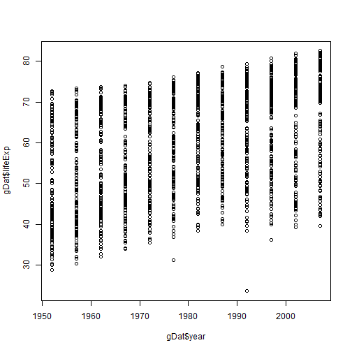

Getting to know a data frame
========================================================
author: 
date: 

Open class project
=======================================================
incremental: true
* Where are you?
* What is in your *Environment*?

Import gapminder
=======================================================
incremental: true

```r
gDat <- read.delim(file="gapminder.5year.txt")
```
 Did it read in correctly?

Ways to check data 
=======================================================
incremental: true
* Did you get any errors?
* Look at *Environment* is it the size you expected?
* attributes() or str()
* head() or tail()
* dim(), nrow(), ncol()
* summmary()

Look at it
=======================================================

```r
plot(gDat$year, gDat$lifeExp)
```



```r
plot(lifeExp~year, data=gDat)
```

Expore the data
========================================================
 Visualizing data is a great way to see trends that you can test.
 Play with it
* histogram()
* Are variables normal?  `qqnorm()`
* What variables do you want to regress against each other?

Slicing and dicing data
=======================================================
* This is where R shines
  `subset(data=object, subset=variable to subset by==value)`
  `object[object$variable==value,]`  


```r
subset(gDat, country == "Canada")
```

```
    country year      pop continent lifeExp gdpPercap
241  Canada 1952 14785584  Americas  68.750  11367.16
242  Canada 1957 17010154  Americas  69.960  12489.95
243  Canada 1962 18985849  Americas  71.300  13462.49
244  Canada 1967 20819767  Americas  72.130  16076.59
245  Canada 1972 22284500  Americas  72.880  18970.57
246  Canada 1977 23796400  Americas  74.210  22090.88
247  Canada 1982 25201900  Americas  75.760  22898.79
248  Canada 1987 26549700  Americas  76.860  26626.52
249  Canada 1992 28523502  Americas  77.950  26342.88
250  Canada 1997 30305843  Americas  78.610  28954.93
251  Canada 2002 31902268  Americas  79.770  33328.97
252  Canada 2007 33390141  Americas  80.653  36319.24
```

```r
gDat[gDat$country=="Canada",]
```

```
    country year      pop continent lifeExp gdpPercap
241  Canada 1952 14785584  Americas  68.750  11367.16
242  Canada 1957 17010154  Americas  69.960  12489.95
243  Canada 1962 18985849  Americas  71.300  13462.49
244  Canada 1967 20819767  Americas  72.130  16076.59
245  Canada 1972 22284500  Americas  72.880  18970.57
246  Canada 1977 23796400  Americas  74.210  22090.88
247  Canada 1982 25201900  Americas  75.760  22898.79
248  Canada 1987 26549700  Americas  76.860  26626.52
249  Canada 1992 28523502  Americas  77.950  26342.88
250  Canada 1997 30305843  Americas  78.610  28954.93
251  Canada 2002 31902268  Americas  79.770  33328.97
252  Canada 2007 33390141  Americas  80.653  36319.24
```
Plot subsets
=============================
plot((subset(gDat, country == "Canada"))$year, (subset(gDat, country == "Canada"))$lifeExp)
plot(data=subset(gDat, country=="Canada"), lifeExp~year)

*But*

mean(data=subset(gDat, country=="Canada"), lifeExp)

subset( gDat, subset=lifeExp < 32)

subset( gDat, subset=lifeExp < 32, select=c(country, lifeExp, pop))

myData <- subset( gDat, subset=lifeExp < 32, select=c(country, 
                                            lifeExp, pop))
myData
mean(myData$lifeExp)
with(myData, mean(lifeExp))

